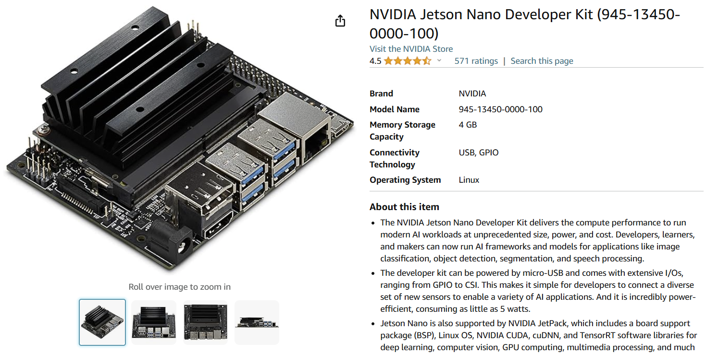
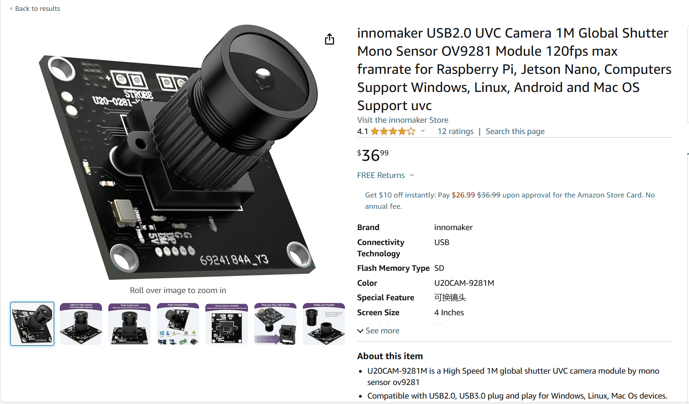

# Phantom Vision
#### Yet another powerful and easy-to-use computer vision solution for FRC
#### Team 5516 "Iron Maple" proudly presents

## Introduction 

Are Limelights too costly? Are coprocessors too complicated? Introducing Phantom Vision: an affordable, powerful, and open-source computer vision solution for FRC. We aim to make computer vision a zero-barrier technology for beginner teams.

## Features

#### Hardware-Accelerated AprilTags Detection

The system's detection of AprilTags is enhanced with GPU acceleration, achieving up to 90fps with minimal CPU load, courtesy of the advanced AI Micro-Processor.

#### AI GamePiece Detection with pretrained dataset

A custom AI object-detection application using NVIDIA Jetson's edge AI libraries with a pre-trained dataset for gamepieces, achieving high accuracy and reliability in gamepieces detection.

#### Communicating with robotRIO

A publisher-subscriber network interface to stream results to the robot controller in real-time.

#### Camera Auto-Calibration Process
An innovative solution that automates the camera calibration process, where the robot is programmed to autonomously navigate to various distances and orient itself at different angles. Concurrently, the system captures frames and analyzes result matrices to determine the camera's field of view (FOV) and installation angle using **linear regression** method.

    
    

## Installation Guide
1. Purchase Parts:
    - (required) <a href="https://www.amazon.com/NVIDIA-Jetson-Nano-Developer-945-13450-0000-100/dp/B084DSDDLT/ref=sr_1_4?crid=38QF39NIW737Y&dib=eyJ2IjoiMSJ9.UROoGsUeBUJnpW20MgKc67OAAh6vAx8E7wPndW2JUTDXFcgi9ouUAV1JgFirAVgckj60NsKd38JREBCZBR4QZ7SrVUSM2dPJfQcVi34_QyECcxQoFcrqBc0Qg5BDLoCeuvG5DRvdpmu7E4asMYmt1AN1B06pj89rMPFQyAxaDOROhDYEh9erbtUsjBUV0vQbQ8ZrCPEah67xyCEeMmmVZ0ZaGS884hRoE3Qu-eNomg8.rC0iqE5LNVfv0ko_8sbT5TQPnAbZS0lghGzYG9uINH0&dib_tag=se&keywords=jetson+nano&qid=1713329705&sprefix=jetson+nano%2Caps%2C352&sr=8-4">Jetson Nano Single Board Computer</a> $145
    - (required) <a href="https://www.amazon.com/SanDisk-128GB-MicroSDXC-Ultra-Memory/dp/B07XDCZ9J3/ref=sr_1_7?crid=YZJW7IK8GU49&dib=eyJ2IjoiMSJ9.Rcms_4y7Aop97ADT2wpTacEsoonJZr52XRFyIoXm7rMzdF2IZ6jUvIbHIZ2f_fACpwu-H9QCvmhoeEGWbLqdBMd9AupNsbmf6Lj1BW5CrbF5YTIF2gdrq-QekZe71WXNwdOt-H7FzCeyfOB1HakmzO9kcumYL79YS3RloOsfqRq5jUD-mW5lJV_s_topjcOVa2HDmWzgCRa5JBz-3grqDc8edrV0hiZ3rHoQptR_gAw.OiGBAadCS16X926rp42S8xKlf9XPnbi5AB_ecoP_19I&dib_tag=se&keywords=64gb+sd+card&qid=1713329963&sprefix=64gb+sd%2Caps%2C156&sr=8-7">64GB SD-Card</a> $15
    - (required) <a href="https://www.amazon.com/innomaker-Shutter-framrate-Raspberry-Computers/dp/B0CLRN9QRC/ref=sr_1_5?crid=1PKHMABPSJNKM&dib=eyJ2IjoiMSJ9.yldIgiAKHtZ_9S95UeZCjYLf5q825ovyB1N8hjF89V-gXcEYFz_x20VFx6_E8xFDsla6dWok7Bt4nZSnkQqaN6eSvSNWjQxHuEIZkrfH_51xb_3TMFiUHeS4XIxKUKUGbe3YAaO58MwhVIgBZUFt844TVivTJ546Xok8uLnuYbqiHifC9sNbYioxDKvVUYSDYcmZdgDaso5_IQKF8chV8Up-ypTbCX-grboGKF6yeh4.GWC4GAGPBbjnuvj2jkXacUADjE1V5MKdcRZGCduzjkE&dib_tag=se&keywords=raspberry+pi+camera+120fps&qid=1713329832&sprefix=raspberry+pi+camera+120fps%2Caps%2C235&sr=8-5">120FPS Infared-Sensitive Global Shutter Camera For AprilTags Detection</a> $37
    - (optinal) <a href="https://www.amazon.com/dp/B0CNCSFQC1?ref=emc_s_m_5_i_atc">1080p high resolution camera for gamepiece detection</a> $16
    - (in case your robot do not have VRM) <a href="https://www.amazon.com/DROK-5-5-30V-Adjustable-Regulator-Converter/dp/B07VNDGFT6/ref=sr_1_4?crid=IFAKHFYQE8H9&dib=eyJ2IjoiMSJ9.9kQsmFsNu13iK2h6MMQG9FRiJhw5PG1MMeuFQU5MFOvMYDpQhjeIKn21ZzY6-TOmgeOcjdJnRk4f1YTvY1nhRUXCu0BDYhaOWXOlx9sbwkY2iKdLsG08nqT2drRZ667-MAg9zSge05P5d7b1nXhyFhzhOGvx_3jDVnMl53hjthYyIF7DnujGwITtyXCLSlCFXH8NZGSTb4TdLh--DQ4-4rzy-LLrzgSJyH9ngVbdLQ0.ubRY_MeSdJSbFri68BduJY8HGXjfc5GBkKoKQMHWrS0&dib_tag=se&keywords=voltage%2Bregulator%2B5v%2B4a&qid=1713330220&sprefix=voltage%2Bregulator%2B5v%2B4a%2Caps%2C128&sr=8-4&th=1">Voltage Regulator Module</a> $16
    

        
        
    

2. Preparations
    - Download our modified Jetpack System Image <a>here</a> 
    - Install <a href="https://www.pygame.org/">Pygame</a>, which is used for our DashBoard
    - Download the <a>CAD File of 3D-Printed Camera </a>
3. Install: 
    - The jetson Nano comes with a DC-Power-Cable, cut the wire and connect to the VRM.
    - Connect the Jetson Nano to the robot-radio via ethernet
    - Connect the April Tag Camera to the Jetson Nano
    - Stick the Camera into its shell using glue, and secure the shell on a horizontal surface.  If you do not use our version of camera shell, you would have to calibrate the camera using server/calibration.py
    - Measure the height of camera in reference to the ground.

4. Run:
    - WARNING! Before you power on, if you are using a custom Voltage Regular Module, unplug Jetson and Check that you have set the voltage to 5.2V~5.5V
    - Power on the robot. The system image is already well-configured such that Phantom Vision will start automatically on boot.  
    - Connect to the robot in driverstation and open a browser, type "onbot-jetson.local:5800" and you should be able to see the camera live stream"
    - run dashboard/client.py, you should be able to see the robot's position on field

## API
The API reference can be found in <a href="./">the java client</a>
## Example Codes
This System has so far been implemented in two robot's control system.
Team 5516 Competition Robot "Phantom Ⅰ" and Team 6706 Competition Robot "Phantom Ⅱ".
The two robots share the same <a href="https://github.com/Shenzhen-Robotics-Alliance/FRC2024-RobotCode">code</a>.

## Contribution
Phantom Vision is a public project, and we welcome anyone from the FIRST Community to contribute.
To see what we are currently working on, check our <a href="">TODOs list</a>.
