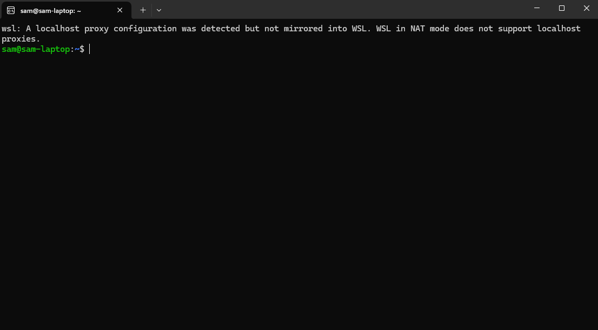
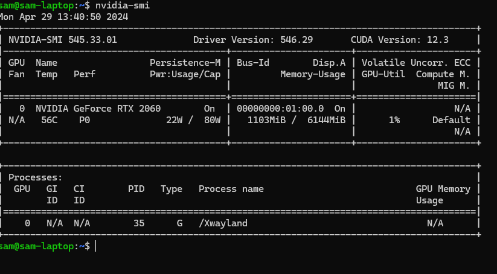

# Roboflow-to-SSD training tool

## About This tool

This is quick guide of training custom object detection models that runs on your FRC Robot's NVIDIA Jetson Co-processors.
Tools Used:
- [Roboflow](https://roboflow.com/)
- [Jetson-Inference](https://github.com/dusty-nv/jetson-inference)

### Step 1: Collect your DataSet

To Collect your own dataset On RobotFlow, please follow [This Guide](https://docs.roboflow.com/datasets/create-a-project).  For this tutorial, we will be using [this](https://universe.roboflow.com/michael-jansen/frc-2024-tlxdn) open source dataset. 

### Step 2: Download Dataset
- Click Download button

- Select Pascal VOC

- Select Download Zip To This Computer

- Unzip the file, you should see:


### Step 3: Prepare Jetson Inference On Jetson
Follow [This Guide](https://github.com/dusty-nv/jetson-inference/blob/master/docs/jetpack-setup-2.md) or open ~/jetson-inference on an [Phantom Jetson]()
### (Optinal) Prepare WSL For Better GPU Performance During Training
- Prepare a Computer with NVIDIA Graphics Card (recommend rtx2060 or newer) and Windows11 System.
- To Install Windows Subsystem For Linux, follow [This Guide](https://learn.microsoft.com/en-us/windows/wsl/install).
- Install [Ubuntu from Microsoft Store](https://apps.microsoft.com/detail/9pn20msr04dw?hl=en-us&gl=US).

- Open Ubuntu 

- NVIDIA Drivers are pre-installed on WSL, type nvidia-smi and you should see this:

- Download [CUDA](https://developer.nvidia.com/cuda-downloads) and install.

- Install Python
```
sudo apt update && sudo apt upgrade
sudo apt install python3
```

- Install [Pytorch](https://pytorch.org/) Cuda
```
pip3 install torch torchvision torchaudio --index-url https://download.pytorch.org/whl/cu118
```

- Get Jetson Inference
```
git clone --recursive --depth=1 https://github.com/dusty-nv/jetson-inference
```

- To move dataset directory to WSL, open File Explorer and type 
```
\\wsl$
```


### Step 4: organizing dataset

- Put the zip file downloaded from roboflow (in our case, FRC2024-voc.zip to your WSL or jetson nano home directory)

- Move it to jetson inference workspace

```
unzip FRC2024-voc.zip

cd jetson-inference/python/training/detection/ssd/

mkdir data/FRC2024/Annotations/ data/FRC2024/JPEGImages/

mv ~/FRC2024-voc/train/*.jpg ./data/FRC2024/JPEGImages

mv ~/FRC2024-voc/train/*.xml ./data/FRC2024/Annotations
```

- now we should use [generate_vocdata.py](https://github.com/dusty-nv/pytorch-ssd/blob/6accaa88845ec135a7d6fe25e9a26afd4698639d/vision/datasets/generate_vocdata.py) from jetson-inference to label the dataset, however it has problems importing data from roboflow, so we use the edited version.

```
# on another terminal
git clone https://github.com/Shenzhen-Robotics-Alliance/FRC-Phantom-Vision.git

cp FRC-Phantom-Vision/roboflow-to-ssd/src/generate_vocdata.py jetson-inference/python/train/detection/ssd/vision/datasets/
```

- now under jetson-inference/python/train/detection/ssd/data/[your dataset name]/, create classes.txt in data dir

```
cd jetson-inference/python/training/detection/ssd/
vim data/FRC2024/classes.txt
```

- enter class names

```
robot, note
```

- under the same direcotry, create lables.txt

```
vim data/FRC2024/labels.txt
```
- enter the class names
```
robot
note
```

- ALERT! do not add an emmpty line in the end of the file, that will cause trouble!!!

- now we are ready to label the dataset:

```
cd jetson-inference/python/training/detection/ssd/
python3 vision/datasets/generate_vocdata.py ./data/FRC2024/
```

- result should look like this:

### Step 5: train

```
cd jetson-inference/python/training/detection/ssd/
wget https://nvidia.box.com/shared/static/djf5w54rjvpqocsiztzaandq1m3avr7c.pth -O models/mobilenet-v1-ssd-mp-0_675.pth
pip3 install -v -r requirements.txt
python3 train_ssd.py --dataset-type=voc --model-dir=models/FRC2024/ --data=./data/FRC2024/ --pretrained-ssd='models/mobilenet-v1-ssd-mp-0_675.pth' --use-cuda --batch-size=8 --workers=8 --epochs=30
```


### Step 5: export

- notice that, since we were running pytorch2 on WSL, you must move the pytorch model to jetson nano to export it to onnx, otherwise, there will be issues.

```
cd jetson-inference/python/training/detection/ssd/
zip -r ./FRC2024-pytorch-model.zip ./models/FRC2024/
```

- copy FRC2024-pytorch-model.zip to jetson nano

- on jetson nano

```
unzip FRC2024-pytorch-model.zip
mv FRC2024/ jetson-inference/python/training/detection/ssd/models/
cd jetson-inference/python/training/detection/ssd/
python3 onnx_export.py --model-dir=models/FRC2024/
ls models/FRC2024/ | grep .onnx
```

- you should see mobilenet.onnx, rename it to your name

```
mv models/FRC2024/mobilenet.onnx ~/FRC-PHANTOM-VISION/server/models/FRC-2024.onnx
mv models/FRC2024/labels.txt ~/FRC-PHANTOM-VISION/server/models/
```